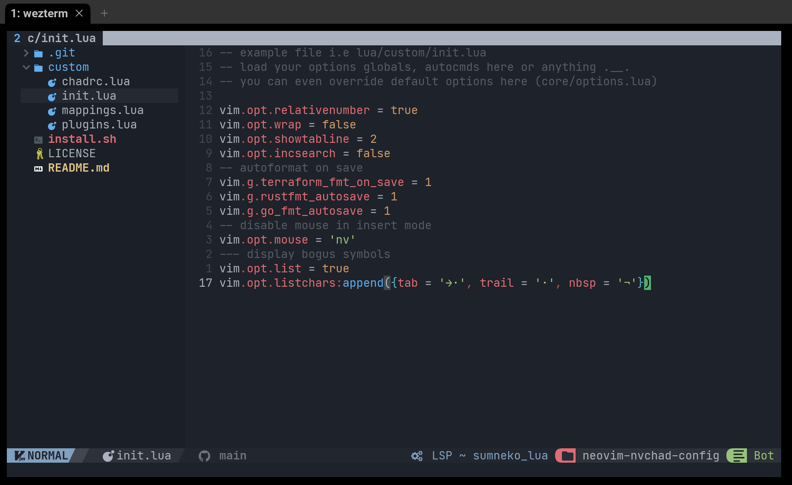

# neovim-nvchad-config

My config files for [NvChad](https://nvchad.github.io/).

I assume that you have [neovim](https://github.com/neovim/neovim) already installed.

```bash
./install.sh
```

Then run nvim like below and install needed tools with `:Mason`:

```bash
nvim +PackerSync
```


